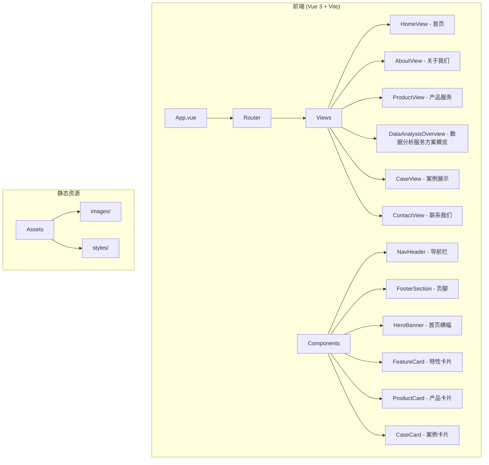

# 广州知运信息技术有限公司官网 - 项目设计文档

## 1. 系统架构

## 2. 页面结构

| 页面 | 路由 | 描述 |
|------|------|------|
| 首页 | `/` | 公司介绍、核心业务、产品亮点 |
| 关于我们 | `/about` | 公司简介、发展历程、企业文化 |
| 产品服务 | `/products` | 智慧物流系统产品介绍 |
| 数据分析服务方案概览 | `/solutions/data-analysis?solution=wms` | 四类分析能力与仓储/运输/配送方案衔接对照，标注缺项、空数据与不适配原因 |
| 案例展示 | `/cases` | 成功案例展示 |
| 联系我们 | `/contact` | 联系方式、地图、留言表单 |

## 3. UI/UX 规范

### 3.1 色彩体系
| 用途 | 色值 | 说明 |
|------|------|------|
| 主色调 | `#1890ff` | 科技蓝，体现智慧物流 |
| 辅助色 | `#52c41a` | 成功绿，物流畅通 |
| 强调色 | `#fa8c16` | 活力橙，创新活力 |
| 文字主色 | `#303133` | 标题文字 |
| 文字次色 | `#606266` | 正文文字 |
| 文字辅助 | `#909399` | 辅助说明 |
| 背景色 | `#f5f7fa` | 页面背景 |
| 卡片背景 | `#ffffff` | 卡片白色 |

### 3.2 字体规范
- 标题字体：`"PingFang SC", "Microsoft YaHei", sans-serif`
- 正文字体：`"PingFang SC", "Microsoft YaHei", sans-serif`
- H1: 36px / bold
- H2: 28px / bold
- H3: 22px / semibold
- 正文: 16px / regular
- 辅助: 14px / regular

### 3.3 间距规范
- 页面内边距: 24px
- 卡片内边距: 20px
- 元素间距: 16px
- 小间距: 8px

### 3.4 圆角规范
- 大圆角: 12px (卡片)
- 中圆角: 8px (按钮)
- 小圆角: 4px (输入框)

### 3.5 阴影规范
- 卡片阴影: `0 4px 12px rgba(0, 0, 0, 0.08)`
- 悬浮阴影: `0 8px 24px rgba(0, 0, 0, 0.12)`

## 4. 组件清单

| 组件名 | 功能 | 复用场景 |
|--------|------|----------|
| NavHeader | 顶部导航栏 | 全局 |
| FooterSection | 页脚信息 | 全局 |
| HeroBanner | 首页大图横幅 | 首页 |
| FeatureCard | 特性展示卡片 | 首页、产品页 |
| ProductCard | 产品介绍卡片 | 产品页 |
| CaseCard | 案例展示卡片 | 案例页 |
| SectionTitle | 区块标题 | 全局 |
| ContactForm | 联系表单 | 联系页 |

## 5. 响应式断点

| 断点 | 宽度 | 布局 |
|------|------|------|
| Desktop | ≥1200px | 4列栅格 |
| Tablet | 768px-1199px | 2列栅格 |
| Mobile | <768px | 单列 |
